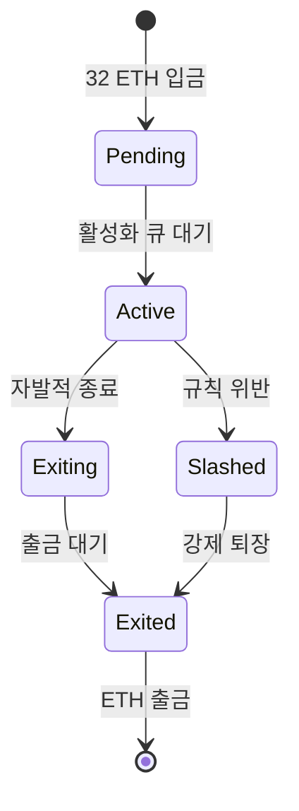
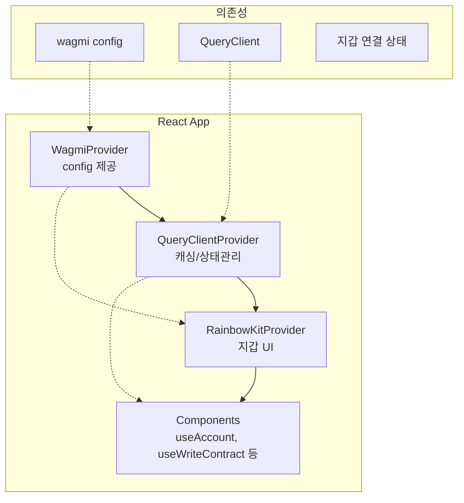

# Week 5 Quiz: PoS/Consensus + RainbowKit

> **제출 방법:** 이 파일을 복사하여 답변을 작성한 후, PR로 제출하세요.
> **평가 기준:** 개념 이해도 중심 - 문법 오류보다 논리적 설명을 중시합니다.

---

## 문제 1: PoS 개념 (객관식)

이더리움이 PoW(작업 증명)에서 PoS(지분 증명)로 전환한 **가장 주요한 이유**는 무엇인가요?

**보기:**
A) 트랜잭션 처리 속도를 10배 이상 높이기 위해
B) 에너지 소비를 99.95% 이상 줄이고 환경 친화적으로 만들기 위해
C) 블록 크기를 늘려서 더 많은 데이터를 저장하기 위해
D) 채굴 장비 없이도 누구나 블록을 생성할 수 있게 하기 위해

**답변:**
B) PoW는 채굴 과정에서 대량의 전력을 소비하는 것이 가장 큰 문제였다. PoS는 연산 경쟁 대신 ETH 스테이킹으로 블록을 검증하므로 에너지 소비를 99.95% 이상 절감하여 환경 친화적으로 만든 것이 핵심 이유이다.


---

## 문제 2: 검증자 역할 (객관식)

이더리움 PoS에서 검증자(Validator)가 수행하는 **두 가지 주요 역할**은 무엇인가요?

**보기:**
A) 블록 채굴(Mining)과 가스 가격 결정
B) 블록 제안(Proposing)과 블록 증명(Attesting)
C) 트랜잭션 전송과 수수료 수집
D) 스마트 컨트랙트 배포와 실행

**답변:**
B) 블록 제안은 선택된 검증자가 새로운 블록을 생성하여 네트워크에 제안하는 역할이다. 블록 증명은 나머지 검증자들이 제안된 블록이 유효한지 확인하고 투표하는 역할이다.


---

## 문제 3: 왜 PoW에서 PoS로? (단답형)

PoW(작업 증명)와 PoS(지분 증명)의 **핵심 차이점**은 무엇인가요?
"자격 증명 방식"과 "보안 보장 방식" 두 관점에서 각각 비교하세요.

**답변:**

자격 증명 방식:
- PoW: 해시 연산 경쟁에서 가장 먼저 정답을 찾은 채굴자가 블록 생성 자격을 얻는다.
- PoS: 32 ETH를 스테이킹한 검증자 중 무작위로 선택된 자가 블록 제안 자격을 얻는다.

보안 보장 방식:
- PoW: 네트워크 공격을 위해 전체 해시파워의 51% 이상을 확보해야 하므로 막대한 하드웨어/전력 비용이 공격 억제력이 된다.
- PoS: 공격을 시도하면 스테이킹한 ETH가 소각되므로 경제적 손실이 공격 억제력이 된다.


---

## 문제 4: 슬래싱의 목적 (단답형)

슬래싱(Slashing)은 검증자의 스테이킹된 ETH를 **강제로 소각**하는 패널티입니다.

1) 슬래싱이 발동되는 **두 가지 조건**은 무엇인가요?
2) **왜** 이런 처벌이 필요한가요? 없다면 어떤 문제가 생길 수 있나요?

**답변:**

1) 슬래싱 조건 (2가지):
   - 이중 투표: 같은 슬롯에서 서로 다른 두 블록에 동시에 투표하는 행위이다.
   - 서라운드 투표: 이전 증명을 감싸는 모순된 증명을 제출하는 행위이다.

2) 슬래싱이 필요한 이유:
   슬래싱이 없으면 검증자가 아무런 경제적 위험 없이 악의적 행동을 시도할 수 있다. 슬래싱은 부정 행위 시 스테이킹한 ETH를 잃게 함으로써 공격 비용을 극대화하고, 검증자가 정직하게 행동하도록 경제적 인센티브를 제공한다.


---

## 문제 5: 체인 선택 규칙 (단답형)

여러 유효한 블록이 동시에 제안되면 **포크(Fork)**가 발생합니다.
이더리움의 LMD-GHOST(Latest Message Driven GHOST) 규칙은 어떻게 "정규 체인"을 선택하나요?

1) LMD-GHOST의 기본 원리는 무엇인가요?
2) **왜** "가장 최근 메시지"를 사용하나요? (오래된 메시지를 사용하면 어떤 문제가?)

**답변:**

1) LMD-GHOST 원리:
   각 검증자의 가장 최근 증명(attestation)만 고려하여, 포크가 발생했을 때 가장 많은 증명 가중치(스테이킹 양)가 축적된 포크를 정규 체인으로 선택한다.

2) 최근 메시지 사용 이유:
   오래된 메시지를 사용하면 검증자가 과거 투표를 재활용하여 이미 폐기된 포크에 허위 지지를 몰아줄 수 있다. 최신 메시지만 반영해야 검증자의 현재 의사를 정확히 반영하고 조작을 방지할 수 있다.


---

## 문제 6: RainbowKit Provider 계층 (빈칸 채우기)

다음 코드의 빈칸을 채워서 RainbowKit을 올바르게 설정하세요.
**Provider 순서가 중요합니다!**

```typescript
'use client';

// TODO: 필요한 스타일 import
_________________________________________

import { RainbowKitProvider } from '@rainbow-me/rainbowkit';
import { WagmiProvider } from 'wagmi';
import { QueryClientProvider, QueryClient } from '@tanstack/react-query';
import { config } from '@/config/wagmi';

const queryClient = new QueryClient();

export default function RootLayout({ children }) {
  return (
    <html lang="ko">
      <body>
        {/* TODO: Provider를 올바른 순서로 중첩하세요 */}
        <_________________ config={config}>
          <_________________ client={queryClient}>
            <_________________>
              {children}
            </_________________>
          </_________________>
        </_________________>
      </body>
    </html>
  );
}
```

**답변:**
```typescript
'use client';

import '@rainbow-me/rainbowkit/styles.css';

import { RainbowKitProvider } from '@rainbow-me/rainbowkit';
import { WagmiProvider } from 'wagmi';
import { QueryClientProvider, QueryClient } from '@tanstack/react-query';
import { config } from '@/config/wagmi';

const queryClient = new QueryClient();

export default function RootLayout({ children }) {
  return (
    <html lang="ko">
      <body>
        <WagmiProvider config={config}>
          <QueryClientProvider client={queryClient}>
            <RainbowKitProvider>
              {children}
            </RainbowKitProvider>
          </QueryClientProvider>
        </WagmiProvider>
      </body>
    </html>
  );
}
```

**왜 이 순서인가요:**
WagmiProvider가 가장 바깥에 있어야 블록체인 연결 설정을 하위 모든 Provider와 컴포넌트에 제공한다. QueryClientProvider는 wagmi의 데이터 패칭/캐싱을 처리해야 하므로 그 안에 위치한다. RainbowKitProvider는 wagmi와 react-query 모두에 의존하므로 가장 안쪽에 위치해야 한다. 순서가 잘못되면 Context를 찾을 수 없다는 런타임 에러가 발생한다.


---

## 문제 7: Provider 순서 버그 (취약점 찾기)

다음 코드에서 **문제점**을 찾고 수정하세요:

```typescript
// BAD CODE - 문제점 찾기
'use client';

import '@rainbow-me/rainbowkit/styles.css';
import { RainbowKitProvider } from '@rainbow-me/rainbowkit';
import { WagmiProvider } from 'wagmi';
import { QueryClientProvider, QueryClient } from '@tanstack/react-query';
import { config } from '@/config/wagmi';

const queryClient = new QueryClient();

export default function Providers({ children }) {
  return (
    // 문제가 있는 Provider 순서!
    <QueryClientProvider client={queryClient}>
      <RainbowKitProvider>
        <WagmiProvider config={config}>
          {children}
        </WagmiProvider>
      </RainbowKitProvider>
    </QueryClientProvider>
  );
}
```

**1) 발견한 문제점:**
Provider 순서가 완전히 뒤집혀 있다. WagmiProvider가 가장 안쪽에 있고, RainbowKitProvider가 WagmiProvider 바깥에 있다.

**2) 왜 이것이 문제인가:**
RainbowKitProvider는 내부적으로 wagmi의 Context에 의존하는데, WagmiProvider보다 바깥에 있으므로 WagmiContext를 찾을 수 없다. 마찬가지로 wagmi 훅들은 QueryClient에 의존하는데 WagmiProvider 안쪽에 QueryClientProvider가 없으므로 데이터 패칭이 실패한다.

**3) 올바른 수정 방법:**
```typescript
'use client';

import '@rainbow-me/rainbowkit/styles.css';
import { RainbowKitProvider } from '@rainbow-me/rainbowkit';
import { WagmiProvider } from 'wagmi';
import { QueryClientProvider, QueryClient } from '@tanstack/react-query';
import { config } from '@/config/wagmi';

const queryClient = new QueryClient();

export default function Providers({ children }) {
  return (
    <WagmiProvider config={config}>
      <QueryClientProvider client={queryClient}>
        <RainbowKitProvider>
          {children}
        </RainbowKitProvider>
      </QueryClientProvider>
    </WagmiProvider>
  );
}
```

---

## 문제 8: 트랜잭션 상태 처리 (빈칸 채우기)

다음 코드의 빈칸을 채워서 트랜잭션 전송 후 **확인 상태를 추적**하세요:

```typescript
'use client';

import { useWriteContract, _________________ } from 'wagmi';

const abi = [
  {
    name: 'increment',
    type: 'function',
    stateMutability: 'nonpayable',
    inputs: [],
    outputs: [],
  },
] as const;

function IncrementButton() {
  const { writeContract, data: hash, isPending } = useWriteContract();

  // TODO: 트랜잭션 확인 상태를 추적하는 hook
  const { isLoading: isConfirming, isSuccess } = _________________({
    _________________,
  });

  return (
    <div>
      <button
        onClick={() =>
          writeContract({
            address: '0x1234...5678',
            abi,
            functionName: 'increment',
          })
        }
        disabled={isPending || isConfirming}
      >
        {isPending ? '서명 대기 중...' : isConfirming ? '확인 중...' : '증가'}
      </button>

      {isSuccess && <p>트랜잭션 성공!</p>}
    </div>
  );
}
```

**답변:**
```typescript
'use client';

import { useWriteContract, useWaitForTransactionReceipt } from 'wagmi';

const abi = [
  {
    name: 'increment',
    type: 'function',
    stateMutability: 'nonpayable',
    inputs: [],
    outputs: [],
  },
] as const;

function IncrementButton() {
  const { writeContract, data: hash, isPending } = useWriteContract();

  const { isLoading: isConfirming, isSuccess } = useWaitForTransactionReceipt({
    hash,
  });

  return (
    <div>
      <button
        onClick={() =>
          writeContract({
            address: '0x1234...5678',
            abi,
            functionName: 'increment',
          })
        }
        disabled={isPending || isConfirming}
      >
        {isPending ? '서명 대기 중...' : isConfirming ? '확인 중...' : '증가'}
      </button>

      {isSuccess && <p>트랜잭션 성공!</p>}
    </div>
  );
}
```

**트랜잭션 상태 흐름을 설명하세요:**

1) isPending 상태: 사용자가 지갑(MetaMask 등)에서 트랜잭션 서명을 승인하기를 기다리는 단계이다.
2) isConfirming 상태: 서명이 완료되어 트랜잭션이 네트워크에 전송된 후, 블록에 포함(채굴)되기를 기다리는 단계이다.
3) isSuccess 상태: 트랜잭션이 블록에 포함되어 온체인에서 성공적으로 실행 완료된 상태이다.


---

## 문제 9: 검증자 생애주기 (다이어그램 해석)

다음 다이어그램은 이더리움 검증자의 생애주기를 보여줍니다:



**질문:**

1) **Active** 상태에서 검증자가 수행하는 주요 활동은 무엇인가요?

블록을 제안(Proposing)하고, 다른 검증자가 제안한 블록의 유효성을 증명(Attesting)하는 것이다. 이를 통해 네트워크의 합의에 참여하고 보상을 받는다.

2) Active에서 **Slashed**로 전이되는 조건은 무엇인가요? 이 경우 검증자에게 어떤 일이 발생하나요?

이중 투표(같은 슬롯에 두 블록 투표)나 서라운드 투표(모순된 증명 제출) 등의 규칙 위반 시 전이된다. 스테이킹한 ETH의 일부가 강제 소각되고, 검증자는 네트워크에서 강제 퇴장당한다.

3) 검증자가 자발적으로 종료(**Exiting**)하려면 왜 바로 ETH를 출금할 수 없고 대기 기간이 필요한가요?

대기 기간이 있어야 해당 검증자가 퇴장 전에 악의적 행동을 하지 않았는지를 네트워크가 검증할 수 있다. 또한 다수의 검증자가 동시에 빠져나가면 네트워크 보안이 약화되므로, 퇴장 속도를 조절하여 네트워크 안정성을 유지하기 위함이다.


---

## 문제 10: Provider 계층 구조 (다이어그램 해석)

다음 다이어그램은 RainbowKit/wagmi 앱의 Provider 구조를 보여줍니다:



**질문:**

1) **WagmiProvider**가 가장 바깥에 있어야 하는 이유는 무엇인가요?

WagmiProvider는 블록체인 연결 설정(chain, transport 등)을 React Context로 제공하며, QueryClientProvider와 RainbowKitProvider 모두 이 Context에 의존하기 때문이다. 가장 바깥에 있어야 하위 모든 컴포넌트에서 wagmi 훅을 사용할 수 있다.

2) **QueryClientProvider**의 역할은 무엇인가요? 없다면 어떤 문제가 발생하나요?

QueryClientProvider는 TanStack Query(react-query)의 캐싱과 비동기 상태 관리를 담당한다. 없으면 wagmi의 데이터 패칭 훅(useBalance, useReadContract 등)이 동작하지 않고, 캐싱이 불가능하여 매번 중복 요청이 발생한다.

3) 아래 코드에서 `useAccount()` hook이 **"Cannot find WagmiContext"** 오류를 발생시키는 이유는 무엇인가요?

```typescript
// 오류 발생 코드
<QueryClientProvider>
  <RainbowKitProvider>
    <WagmiProvider>  {/* WagmiProvider가 안쪽에 있음 */}
      <MyComponent />  {/* useAccount() 호출 */}
    </WagmiProvider>
  </RainbowKitProvider>
</QueryClientProvider>
```

RainbowKitProvider가 WagmiProvider보다 바깥에 위치해 있기 때문이다. RainbowKitProvider 내부에서 wagmi의 Context를 참조하려 하지만, 아직 WagmiProvider가 렌더링되지 않은 상태이므로 WagmiContext를 찾을 수 없다는 에러가 발생한다.


---

## 제출 전 체크리스트

- [x] 모든 문제에 답변을 작성했는가?
- [x] 객관식 문제: 정답 선택 **이유**를 설명했는가?
- [x] 단답형 문제: 2-3문장 이상으로 충분히 설명했는가?
- [x] 코드 문제: 완성된 코드와 **왜 그렇게 작성했는지** 설명했는가?
- [x] 다이어그램 문제: 각 질문에 논리적으로 답변했는가?
