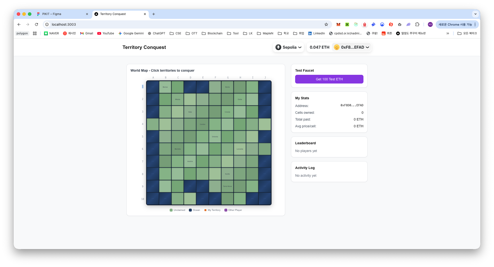

# Week 6: Territory Conquest (땅따먹기)

ETH 기반 10x10 격자 땅따먹기 게임입니다. 플레이어가 ETH를 지불하여 연결된 영역을 점령하고, 다른 플레이어의 영토를 더 높은 금액으로 빼앗을 수 있습니다.

## 게임 규칙

- **점령**: ETH를 지불하면 금액에 비례하여 연결된 칸들을 점령 (칸당 가격 = 총 금액 / 칸 수)
- **탈취**: 이미 점령된 칸을 빼앗으려면 기존 가격보다 더 높은 금액 필요
- **환불**: 빼앗긴 플레이어에게 기존 가격의 80% 환불 (pull pattern)
- **수수료**: 탈취 시 기존 가격의 20%가 컨트랙트 수수료로 축적
- **전략**: 넓게 퍼지면 방어가 약해지고, 집중하면 방어가 강해지는 트레이드오프

## 기술 스택

- **Smart Contract**: Solidity 0.8.26, Foundry
- **Frontend**: Next.js 14 (App Router), TypeScript, Tailwind CSS
- **Web3**: wagmi v2, viem v2, RainbowKit v2
- **Network**: Sepolia Testnet

## 프로젝트 구조

```
week-06/dev/
├── src/TerritoryGame.sol       # 땅따먹기 스마트 컨트랙트
├── test/TerritoryGame.t.sol    # Foundry 테스트 (22개)
├── script/Deploy.s.sol         # 배포 스크립트
└── frontend/
    ├── app/                    # Next.js 페이지
    ├── components/             # UI 컴포넌트 (GameGrid, Cell, ClaimDialog 등)
    ├── hooks/                  # wagmi 커스텀 훅
    ├── lib/connectivity.ts     # Off-chain BFS 연결성 검증
    └── config/contract.ts      # ABI + 컨트랙트 주소
```

## 설치 및 실행

### Smart Contract 테스트

```bash
# 프로젝트 루트에서
forge test --match-path week-06/dev/test/*.t.sol -vv
```

### Frontend 실행

```bash
cd week-06/dev/frontend
npm install
npm run dev
```

http://localhost:3000 에서 확인

### 로컬 Anvil 배포

```bash
# 터미널 1: Anvil 실행
anvil

# 터미널 2: 배포
forge script week-06/dev/script/Deploy.s.sol --rpc-url http://127.0.0.1:8545 --broadcast
```

### Sepolia 배포

```bash
# .env에 PRIVATE_KEY 설정 후
forge script week-06/dev/script/Deploy.s.sol --rpc-url sepolia --broadcast
```

## 배포 정보

- **Network**: Sepolia Testnet
- **Contract Address**: [`0xb88aB534b88f3C339b531B8038894D2aA1cbC30A`](https://sepolia.etherscan.io/address/0xb88aB534b88f3C339b531B8038894D2aA1cbC30A)

## 스크린샷

### 1. 메인 화면 - 지갑 연결 후 초기 상태
10x10 월드맵과 우측 패널(Test Faucet, My Stats, Leaderboard, Activity Log) 표시


### 2. 영역 선택 및 점령 다이얼로그
칸을 선택하면 Claim Territory 다이얼로그에서 비용 확인 후 점령 가능


### 3. MetaMask 트랜잭션 승인
점령 시 MetaMask에서 ETH 전송 트랜잭션 확인 및 승인


### 4. 점령 완료 - 내 영토 표시
트랜잭션 확인 후 점령된 칸이 내 색상으로 표시되고 Leaderboard/Activity Log 업데이트


### 5. 다른 플레이어의 영토 탈취 시도
이미 점령된 칸을 선택하면 Takeover details에서 현재 가격을 확인하고 더 높은 금액으로 탈취 가능


### 6. 탈취 트랜잭션 진행 중
Conquering territory... 로딩 표시와 함께 트랜잭션 처리 대기


### 7. 탈취 완료 - 리더보드 변동
탈취 성공 후 영토 색상 변경, Leaderboard 순위 업데이트


## 컨트랙트 주요 함수

| 함수 | 설명 |
|------|------|
| `claimCells(uint8[])` | 여러 칸을 한 번에 점령 (핵심 함수) |
| `claimCell(uint8)` | 단일 칸 점령 (편의 함수) |
| `withdraw()` | 환불금 출금 (pull pattern) |
| `getFullGrid()` | 전체 격자 상태 조회 |
| `getPlayerStats(address)` | 플레이어 통계 조회 |

## 사용 방법

1. 지갑 연결 (MetaMask 등)
2. 10x10 격자에서 점령할 칸들을 클릭하여 선택
3. 연결된 칸들만 선택 가능 (프론트엔드에서 실시간 검증)
4. "Claim" 버튼으로 ETH 지불 + 점령 트랜잭션 실행
5. 리더보드에서 순위 확인
6. 빼앗긴 경우 "Withdraw" 버튼으로 환불금 수령
