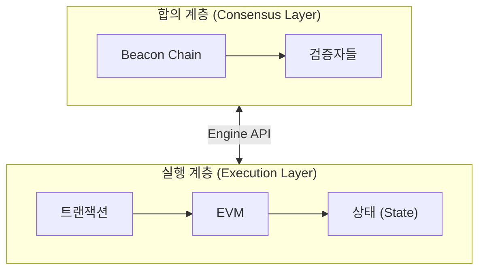
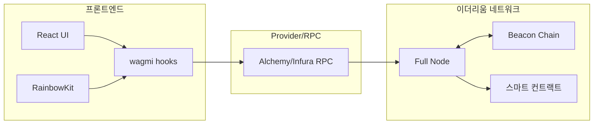

# Week 6 Quiz: Beacon Chain/Finality + Final Project Integration

> **제출 방법:** 이 파일을 복사하여 답변을 작성한 후, PR로 제출하세요.
> **평가 기준:** 개념 이해도 중심 - 6주간 배운 내용을 **통합**하여 설명하세요.

---

## 문제 1: Beacon Chain 역할 (객관식)

Beacon Chain의 **주요 역할**은 무엇인가요?

**보기:**
A) 스마트 컨트랙트를 실행하고 상태를 관리한다
B) 검증자를 관리하고 합의를 조정하며 블록 최종성을 결정한다
C) 트랜잭션 수수료를 계산하고 분배한다
D) 사용자의 지갑을 생성하고 개인키를 관리한다

**답변:**
정답은 B다. Beacon Chain은 Consensus Layer로서 Validator를 관리하고 합의를 조정하며 Finality를 결정한다. 트랜잭션 실행과 상태 관리는 Execution Layer가 담당한다.


---

## 문제 2: Finality 개념 (객관식)

이더리움에서 **Finality(최종성)**가 달성되면 어떤 상태인가요?

**보기:**
A) 트랜잭션이 mempool에 들어간 상태
B) 블록이 체인에 추가되었지만 아직 재조직(reorg)될 수 있는 상태
C) 전체 검증자의 1/3 이상이 슬래싱되지 않는 한 절대 변경되지 않는 상태
D) 24시간이 지나서 트랜잭션이 만료된 상태

**답변:**
정답은 C다. 전체 Validator의 3분의 1 이상이 슬래싱되지 않는 한 블록 상태가 변경 불가능해지기 때문이다. Finality는 트랜잭션의 불가역성을 보장하여 이중 지불 공격을 방지하므로 중요하다.


---

## 문제 3: 왜 Finality가 중요한가 (단답형)

거래소나 dApp 개발자에게 **Finality**가 왜 중요한가요?
다음 시나리오를 예로 들어 설명하세요:

> 사용자가 거래소에 100 ETH를 입금하고, 거래소가 확인 후 내부 잔액에 반영했습니다.
> 그런데 나중에 블록 재조직(reorg)이 발생하여 입금 트랜잭션이 사라졌습니다.

**답변:**
1. reorg 발생 시 거래소는 존재하지 않는 입금 내역에 대해 자금을 지급하는 손실을 입는다.
2. Finality가 달성된 블록은 뒤집히지 않으므로 거래소는 Finality 이후 자금을 처리하면 안전하다.
3. 이더리움에서 Finality까지 2 Epoch, 약 12.8분 기다려야 한다.


---

## 문제 4: 포크 선택 규칙 (단답형)

이더리움은 **Casper FFG**와 **LMD-GHOST** 두 가지 메커니즘을 결합합니다.
각각의 역할은 무엇이며, **왜** 둘 다 필요한가요?

**답변:**
1. Casper FFG: 체크포인트를 통해 체인에 Finality를 부여한다.
2. LMD-GHOST: 가장 무거운 가중치를 가진 체인을 선택하여 포크를 해결하고 헤드 블록을 결정한다.
3. 둘 다 필요한 이유: LMD-GHOST만으로는 Finality를 달성할 수 없고 Casper FFG만으로는 블록 생성 중간의 포크를 실시간으로 해결할 수 없다.


---

## 문제 5: dApp 아키텍처 설계 (코드/아키텍처 문제)

당신은 "간단한 투표 dApp"을 만들려고 합니다.
다음 요구사항을 읽고 **컴포넌트 구조**와 **사용할 hook**들을 설계하세요.

**요구사항:**
- 사용자가 지갑을 연결할 수 있다
- 현재 투표 현황(찬성/반대 수)을 조회할 수 있다
- 사용자가 찬성 또는 반대 투표를 할 수 있다
- 투표 후 결과가 화면에 즉시 반영된다

**답변:**

```text
1. 컴포넌트 구조: 지갑 연결 버튼, 투표 현황 표시 영역, 투표 실행 버튼

2. 사용할 hook:
   - 지갑 연결: ConnectButton
   - 투표 현황 조회: useReadContract
   - 투표 실행: useWriteContract
   - 트랜잭션 확인: useWaitForTransactionReceipt

3. Provider 계층 구조: WagmiProvider 하위에 QueryClientProvider와 RainbowKitProvider 배치
```

**왜 이렇게 설계했나요:**
ConnectButton으로 지갑을 연결한다. useReadContract로 블록체인 상태를 읽고 useWriteContract로 트랜잭션을 발생시킨다. useWaitForTransactionReceipt로 마이닝 완료를 감지하여 UI를 즉시 업데이트한다.


---

## 문제 6: 컨트랙트-프론트엔드 연동 (빈칸 채우기)

다음 코드의 빈칸을 채워서 투표 컨트랙트와 프론트엔드를 연동하세요:

**Solidity 컨트랙트:**
```solidity
contract Voting {
    uint256 public yesVotes;
    uint256 public noVotes;

    function voteYes() external {
        yesVotes += 1;
    }

    function voteNo() external {
        noVotes += 1;
    }
}
```

**React 컴포넌트:**
```typescript
import { useReadContract, useWriteContract, _________________ } from 'wagmi';

const votingABI = [
  { name: 'yesVotes', type: 'function', stateMutability: 'view', inputs: [], outputs: [{ type: 'uint256' }] },
  { name: 'noVotes', type: 'function', stateMutability: 'view', inputs: [], outputs: [{ type: 'uint256' }] },
  { name: 'voteYes', type: 'function', stateMutability: 'nonpayable', inputs: [], outputs: [] },
  { name: 'voteNo', type: 'function', stateMutability: 'nonpayable', inputs: [], outputs: [] },
] as const;

function VotingApp() {
  // 찬성 투표 수 조회
  const { data: yesCount, refetch: refetchYes } = useReadContract({
    address: '0x1234...5678',
    abi: votingABI,
    functionName: '_________________',
  });

  // 반대 투표 수 조회
  const { data: noCount, refetch: refetchNo } = useReadContract({
    address: '0x1234...5678',
    abi: votingABI,
    functionName: '_________________',
  });

  // 투표 실행
  const { writeContract, data: hash, isPending } = useWriteContract();

  // 트랜잭션 확인 대기
  const { isLoading: isConfirming, isSuccess } = _________________({
    hash,
  });

  // 트랜잭션 성공 시 데이터 새로고침
  // TODO: isSuccess가 true가 되면 refetch를 호출해야 함

  const handleVoteYes = () => {
    writeContract({
      address: '0x1234...5678',
      abi: votingABI,
      functionName: '_________________',
    });
  };

  return (
    <div>
      <h2>현재 투표 현황</h2>
      <p>찬성: {_________________}</p>
      <p>반대: {noCount?.toString()}</p>

      <button onClick={handleVoteYes} disabled={isPending || isConfirming}>
        {isPending ? '서명 중...' : isConfirming ? '확인 중...' : '찬성 투표'}
      </button>

      {isSuccess && <p>투표 완료!</p>}
    </div>
  );
}
```

**답변:**
```typescript
import { useReadContract, useWriteContract, useWaitForTransactionReceipt } from 'wagmi';
import { useEffect } from 'react';

const votingABI = [
  { name: 'yesVotes', type: 'function', stateMutability: 'view', inputs: [], outputs: [{ type: 'uint256' }] },
  { name: 'noVotes', type: 'function', stateMutability: 'view', inputs: [], outputs: [{ type: 'uint256' }] },
  { name: 'voteYes', type: 'function', stateMutability: 'nonpayable', inputs: [], outputs: [] },
  { name: 'voteNo', type: 'function', stateMutability: 'nonpayable', inputs: [], outputs: [] },
] as const;

function VotingApp() {
  const { data: yesCount, refetch: refetchYes } = useReadContract({
    address: '0x1234...5678',
    abi: votingABI,
    functionName: 'yesVotes',
  });

  const { data: noCount, refetch: refetchNo } = useReadContract({
    address: '0x1234...5678',
    abi: votingABI,
    functionName: 'noVotes',
  });

  const { writeContract, data: hash, isPending } = useWriteContract();

  const { isLoading: isConfirming, isSuccess } = useWaitForTransactionReceipt({
    hash,
  });

  useEffect(() => {
    if (isSuccess) {
      refetchYes();
      refetchNo();
    }
  }, [isSuccess, refetchYes, refetchNo]);

  const handleVoteYes = () => {
    writeContract({
      address: '0x1234...5678',
      abi: votingABI,
      functionName: 'voteYes',
    });
  };

  return (
    <div>
      <h2>현재 투표 현황</h2>
      <p>찬성: {yesCount?.toString()}</p>
      <p>반대: {noCount?.toString()}</p>

      <button onClick={handleVoteYes} disabled={isPending || isConfirming}>
        {isPending ? '서명 중...' : isConfirming ? '확인 중...' : '찬성 투표'}
      </button>

      {isSuccess && <p>투표 완료!</p>}
    </div>
  );
}
```

**데이터 흐름을 설명하세요:**
사용자가 투표 버튼을 클릭하면 지갑 서명 후 트랜잭션이 전송된다. 트랜잭션이 블록에 포함되면 isSuccess 상태가 갱신되고 useEffect가 실행되어 refetchYes와 refetchNo 함수로 최신 투표 현황을 읽어와 화면을 업데이트한다.


---

## 문제 7: 트랜잭션 흐름 디버깅 (취약점 찾기)

다음 코드에서 **문제점**을 찾고 수정하세요. 사용자가 투표를 해도 화면이 업데이트되지 않습니다.

```typescript
// BAD CODE - 왜 화면이 업데이트되지 않나요?
function BrokenVoting() {
  const { data: voteCount } = useReadContract({
    address: '0x...',
    abi: votingABI,
    functionName: 'yesVotes',
  });

  const { writeContract, data: hash } = useWriteContract();

  const { isSuccess } = useWaitForTransactionReceipt({ hash });

  const handleVote = () => {
    writeContract({
      address: '0x...',
      abi: votingABI,
      functionName: 'voteYes',
    });
  };

  // isSuccess가 true가 되어도 voteCount가 업데이트되지 않음!

  return (
    <div>
      <p>찬성: {voteCount?.toString()}</p>
      <button onClick={handleVote}>투표</button>
      {isSuccess && <p>투표 완료!</p>}
    </div>
  );
}
```

**1. 발견한 문제점:**
트랜잭션이 성공해도 데이터를 다시 가져오는 로직이 없다.

**2. 올바른 수정 방법:**
```typescript
import { useEffect } from 'react';

function BrokenVoting() {
  const { data: voteCount, refetch } = useReadContract({
    address: '0x...',
    abi: votingABI,
    functionName: 'yesVotes',
  });

  const { writeContract, data: hash } = useWriteContract();

  const { isSuccess } = useWaitForTransactionReceipt({ hash });

  useEffect(() => {
    if (isSuccess) {
      refetch();
    }
  }, [isSuccess, refetch]);

  const handleVote = () => {
    writeContract({
      address: '0x...',
      abi: votingABI,
      functionName: 'voteYes',
    });
  };

  return (
    <div>
      <p>찬성: {voteCount?.toString()}</p>
      <button onClick={handleVote}>투표</button>
      {isSuccess && <p>투표 완료!</p>}
    </div>
  );
}
```

**3. refetch가 필요한 이유:**
블록체인 데이터가 변경되어도 React 앱은 이를 자동으로 알지 못한다. 따라서 트랜잭션 성공 후 직접 상태를 갱신해야 한다.


---

## 문제 8: Beacon Chain 구조 (다이어그램 해석)

다음 다이어그램은 이더리움의 두 계층 구조를 보여줍니다:



**질문:**

1. 합의 계층과 실행 계층의 역할 차이는 무엇인가요?
Consensus Layer는 Validator를 관리하고 체인 합의와 Finality를 결정한다. Execution Layer는 EVM을 구동하여 트랜잭션을 실행하고 상태를 업데이트한다.

2. Engine API를 통해 두 계층이 주고받는 정보는 무엇인가요?
Execution Layer는 실행된 페이로드를 Consensus Layer에 전달하고 Consensus Layer는 블록 유효성 검증 결과와 헤드 업데이트 정보를 Execution Layer에 전달한다.

3. 사용자가 트랜잭션을 전송하면 Consensus Layer와 Execution Layer에서 각각 어떤 일이 일어나나요?
Execution Layer는 mempool에 트랜잭션을 저장하고 EVM에서 실행하여 상태를 바꾼다. Consensus Layer는 이를 포함한 블록을 생성하고 다른 Validator에게 전파하여 합의를 이룬다.


---

## 문제 9: Slot/Epoch 관계 (다이어그램 해석)

다음 다이어그램은 Slot과 Epoch의 관계를 보여줍니다:

```mermaid
gantt
    title Epoch 구조 (6.4분)
    dateFormat X
    axisFormat %s

    section Epoch N
    Slot 0     :a1, 0, 12
    Slot 1     :a2, 12, 24
    Slot 2     :a3, 24, 36
    ...        :a4, 36, 372
    Slot 31    :a5, 372, 384

    section Checkpoint
    Epoch N 끝 :milestone, 384, 0
```



**질문:**

1. 1 Slot은 몇 초이고, 1 Epoch은 몇 개의 Slot으로 구성되나요?
1 Slot은 12초이고 1 Epoch은 32개의 Slot이다.

2. Checkpoint는 언제 발생하며 어떤 역할을 하나요?
매 Epoch의 시작 블록마다 발생하며 Casper FFG가 Finality를 부여하는 기준점이다.

3. Finality가 달성되려면 몇 Epoch이 필요하고, 시간로는 약 몇 분인가요?
2 Epoch이 필요하며 약 12.8분이다.


---

## 문제 10: dApp 전체 아키텍처 (다이어그램 해석)

다음 다이어그램은 dApp의 전체 아키텍처를 보여줍니다:



**질문:**

1. 사용자가 투표하기 버튼을 클릭하면, UI에서 스마트 컨트랙트까지 데이터가 어떤 경로로 전달되나요?
React UI에서 wagmi로 트랜잭션 서명을 요청하고 RPC Provider를 통해 Full Node로 전송된 후 스마트 컨트랙트에서 실행된다.

2. RPC Provider의 역할은 무엇인가요? 없다면 어떤 문제가 생기나요?
dApp과 네트워크를 연결하는 서버 역할을 한다. 없다면 사용자가 직접 Full Node를 운영해야 한다.

3. 6주간 배운 내용을 종합하여, 트랜잭션이 전송 -> 실행 -> 블록 포함 -> Finality까지 거치는 전체 흐름을 설명하세요.
지갑이 트랜잭션을 서명하여 RPC로 전송하면 네트워크 mempool에 저장된다. Block Proposer가 트랜잭션을 EVM에서 실행하여 블록에 포함시킨다. Validator들이 합의하여 블록이 체인에 연결되고 2 Epoch 후 Finality가 달성된다.


---

## 제출 전 체크리스트

- [x] 모든 문제에 답변을 작성했는가?
- [x] 객관식 문제: 정답 선택 **이유**를 설명했는가?
- [x] 단답형 문제: 2-3문장 이상으로 충분히 설명했는가?
- [x] 코드 문제: 완성된 코드와 **왜 그렇게 작성했는지** 설명했는가?
- [x] 다이어그램 문제: 6주간 배운 내용을 **연결**지어 설명했는가?

---

## 6주 과정 축하합니다!

이 퀴즈를 완료하면 6주 이더리움 온보딩 이론 과정이 마무리됩니다.

**배운 것들:**
- Week 1: State, Account, EOA vs CA
- Week 2: Transaction, Signature, Security (Private Key)
- Week 3: EVM, Gas, Security (Reentrancy, CEI)
- Week 4: Block, Network, MPT, Security (Eclipse, 51%)
- Week 5: PoS, Validator, Consensus, RainbowKit
- Week 6: Beacon Chain, Finality, Full-stack Integration

**다음 단계:** 나만의 dApp 프로젝트를 시작하세요!
